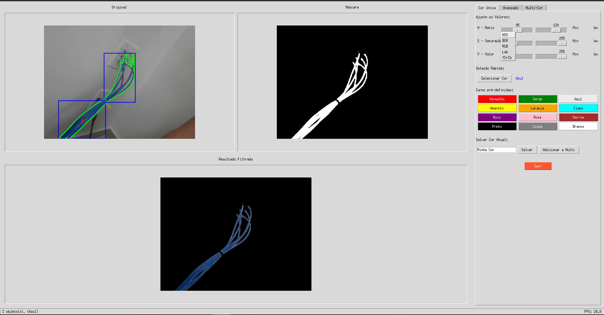

# 🎨 App Filtro de Cores com OpenCV & Tkinter ✨

[](https://python.org)
[](https://opensource.org/licenses/MIT)
[](https://opencv.org/)
[](https://docs.python.org/3/library/tkinter.html)

Aplicação de detecção e filtragem de cores em tempo real usando sua webcam, com controles avançados de processamento de imagem e uma interface amigável em Tkinter.

---

## 🌟 Visão Geral

`ColorFilterApp` fornece uma interface gráfica para aproveitar o poder do OpenCV para filtragem de cores em tempo real. Ele captura vídeo da sua webcam, permite definir faixas de cores em vários espaços de cor (HSV, BGR, RGB, Lab, YCrCb), aplicar técnicas de processamento de imagem como desfoque (blur) e operações morfológicas, e visualizar simultaneamente o feed original, a máscara de cor gerada e o resultado final filtrado. Inclui funcionalidades para detecção multi-cor e gerenciamento de presets (cores pré-definidas).

---

## 🚀 Funcionalidades Principais

*   **🖼️ Visualização em Tempo Real:** Exibe os fluxos de vídeo Original, Máscara e Resultado Filtrado.
*   **🌈 Filtragem de Cor Flexível:**
    *   Suporta múltiplos espaços de cor (HSV, BGR, RGB, Lab, YCrCb).
    *   Sliders interativos para ajuste fino dos limiares Mín/Máx para cada canal.
    *   Tratamento especial para a natureza circular do Matiz (Hue) em HSV (ex: para vermelho).
*   **🖱️ Seleção Rápida de Cor:**
    *   Botões pré-definidos para cores comuns (Vermelho, Verde, Azul, etc.).
    *   Integração com o seletor de cores do sistema (`colorchooser`) para fácil aproximação da faixa.
*   **⚙️ Processamento Avançado de Imagem:**
    *   Desfoque Gaussiano (Gaussian Blur) para redução de ruído.
    *   Operações Morfológicas (Erosão & Dilatação) para refinamento da máscara.
    *   Detecção de contornos com filtragem por área mínima.
*   **👁️ Opções de Visualização de Contornos:**
    *   Desenhar contornos detectados.
    *   Desenhar caixas delimitadoras (bounding boxes) ao redor dos objetos.
    *   Marcar o centro dos objetos detectados.
*   **🎨 Modo de Detecção Multi-Cor:**
    *   Salvar configurações atuais do filtro como presets nomeados.
    *   Ativar modo para detectar múltiplas cores salvas simultaneamente.
    *   Gerenciar cores salvas (Visualizar, Carregar, Remover, Limpar Tudo) em uma lista rolável com amostras de cor.
*   **📊 Interface Gráfica Intuitiva:**
    *   Interface organizada em abas (Cor Única, Avançado, Multi-Cor).
    *   Sliders visuais e checkboxes para ajuste de parâmetros.
    *   Barra de status com contagem de objetos, FPS e informação do modo atual.

---

## 📸 Capturas de Tela


**Exemplo de Placeholder:**

*Interface Principal:*



---

## 📋 Requisitos

*   **Python:** Versão 3.8 ou superior recomendada.
*   **Bibliotecas Python:**
    *   `opencv-python`: Biblioteca principal para tarefas de visão computacional.
    *   `numpy`: Pacote fundamental para operações numéricas.
    *   `Pillow` (PIL Fork): Usada para conversão de formato de imagem entre OpenCV e Tkinter.
    *   `tkinter` & `tkinter.ttk`: Bibliotecas padrão do Python para a GUI (geralmente incluídas).
*   **Hardware:** Uma webcam funcional conectada ao seu computador.

---

## 🔧 Instalação

1.  **Clone o repositório (Opcional):**
    ```bash
    git clone https://github.com/JPEDROPS092/ColorDeteccao.git
    cd ColorDeteccao
    ```

2.  **Instale as Dependências:**
    Abra seu terminal ou prompt de comando e execute:
    ```bash
    pip install opencv-python numpy Pillow
    ```
    Ou, se você tiver um arquivo `requirements.txt`:
    ```bash
    pip install -r requirements.txt
    ```

---

## ▶️ Como Usar

1.  **Execute a Aplicação:**
    Navegue até o diretório que contém o script (`color_filter_app.py` ou o nome que você deu) no seu terminal e execute:
    ```bash
    python nome_do_seu_script.py
    ```
    A aplicação tentará iniciar a webcam padrão.

2.  **Visão Geral da Interface:**
    *   **Painel Esquerdo:** Exibe os feeds de vídeo `Original` (com sobreposições opcionais), `Máscara` e `Resultado Filtrado`.
    *   **Painel Direito:** Contém as abas de controle.

3.  **Abas de Controle:**
    *   **`Cor Única`:**
        *   **Sliders:** Ajuste `Min`/`Max` para os 3 canais do espaço de cor selecionado. Os rótulos mudam dinamicamente (ex: `H - Matiz`, `S - Saturação`, `V - Valor` para HSV).
        *   **`Selecionar Cor`:** Use o seletor de cores do sistema para definir uma faixa de filtro aproximada.
        *   **Botões Pré-definidos:** Clique em botões como `Vermelho`, `Verde` para carregar faixas de filtro comuns (melhor em HSV).
        *   **Salvar:** Dê um nome às configurações atuais dos sliders e clique em `Salvar` ou `Adicionar a Multi` para adicioná-la à lista Multi-Cor.
        *   **`Sair`:** Encerra a aplicação.
    *   **`Avançado`:**
        *   **`Espaço de Cor`:** Escolha o espaço de cor para filtragem (HSV, BGR, RGB, Lab, YCrCb).
        *   **`Erosão`/`Dilatação`:** Controle o tamanho do kernel das operações morfológicas (0 para desativar).
        *   **`Suavização`:** Controle o tamanho do kernel do Gaussian Blur (0 para desativar).
        *   **`Área Mínima`:** Defina a área mínima em pixels para um contorno ser considerado um objeto.
        *   **`Opções de Visualização`:** Alterne a exibição de contornos, caixas delimitadoras e centros de objetos no feed `Original`.
    *   **`Multi-Cor`:**
        *   **`Ativar Modo Multi-Cor`:** Marque para detectar todas as cores salvas simultaneamente.
        *   **`Cores Salvas`:** Uma lista rolável dos seus presets salvos. Cada um mostra uma amostra de cor, nome, espaço, faixas e botões `Usar` / `X`.
            *   `Usar`: Carrega o preset nos sliders principais (desativa o modo Multi-Cor).
            *   `X`: Remove o preset.
        *   **`Adicionar Cor Atual`:** Adiciona as configurações atuais dos sliders da aba `Cor Única` a esta lista.
        *   **`Limpar Todas`:** Remove todos os presets salvos.

4.  **Barra de Status:**
    Localizada na parte inferior, mostra contagem de objetos, FPS aproximado, modo atual e mensagens de erro.

---

## 🤔 Como Funciona (Lógica Principal)

A aplicação executa um loop principal `update`:

1.  **Ler Quadro:** Captura um quadro da webcam.
2.  **Converter:** Altera o quadro para o espaço de cor selecionado (ex: BGR para HSV).
3.  **Pré-processar:** Aplica Gaussian Blur se habilitado.
4.  **Mascarar:** Cria uma máscara binária com base na(s) faixa(s) de cor definida(s).
    *   *Modo Único:* Usa os valores atuais dos sliders, tratando o wrap-around do Matiz HSV.
    *   *Modo Multi:* Itera pelos presets salvos que correspondem ao espaço atual, combinando as máscaras com OU (OR).
5.  **Refinar:** Aplica Erosão e Dilatação à máscara se habilitado.
6.  **Encontrar Contornos:** Detecta regiões contínuas na máscara final.
7.  **Filtrar e Desenhar:** Filtra contornos por área mínima e desenha as visualizações selecionadas (contornos, caixas, centros) em uma cópia do quadro original.
8.  **Aplicar Máscara:** Cria a visualização `Resultado Filtrado` usando `cv2.bitwise_and`.
9.  **Exibir:** Converte as imagens processadas do OpenCV (BGR/Cinza) para RGB, redimensiona-as, converte para o formato PIL, depois para `ImageTk.PhotoImage`, e atualiza os widgets `Label` do Tkinter, **mantendo crucialmente uma referência** aos objetos `PhotoImage`.
10. **Atualizar Status:** Calcula o FPS e atualiza o texto da barra de status.
11. **Agendar:** Usa `root.after()` para chamar o loop `update` novamente.

---

## 🏗️ Estrutura do Código

A aplicação é organizada dentro da classe `ColorFilterApp`:

*   `__init__`: Lida com inicialização (GUI, câmera, variáveis) e inicia o loop de atualização.
*   `setup_gui`: Constrói os elementos da interface Tkinter.
*   `create_slider_set`, `create_preset_buttons`: Métodos auxiliares para criação da GUI.
*   `get_color_presets`, `set_preset`, `choose_color`: Métodos para lidar com seleção de cor e presets.
*   `save_current_color`, `add_current_color_to_multi`, `clear_all_colors`, `update_color_list`, `load_color`, `remove_color`: Métodos para gerenciar a lista de presets multi-cor.
*   `change_color_space`: Atualiza os rótulos da GUI e redefine valores dos sliders quando o espaço de cor muda.
*   `update`: O loop principal de processamento e exibição.
*   `update_status`: Atualiza a barra de status inferior.
*   `quit`: Lida com a liberação da câmera e o fechamento correto da aplicação.

---

## 🛑 Como Sair

Clique no botão **`Sair`** na aba `Cor Única` ou feche a janela principal da aplicação. O recurso da webcam será liberado automaticamente.

---

## 🤝 Contribuições

Contribuições, issues e sugestões de funcionalidades são bem-vindos! Sinta-se à vontade para verificar a [página de issues](https://github.com/JPEDROPS092/AppColorOpenCV/issues) ou abrir uma nova. Por favor, siga as práticas padrão de codificação ao enviar pull requests.

---

## 📜 Licença

Este projeto está licenciado sob a Licença MIT - veja o arquivo [LICENSE.md](LICENSE.md) *(você deve criar este arquivo)* para detalhes.
